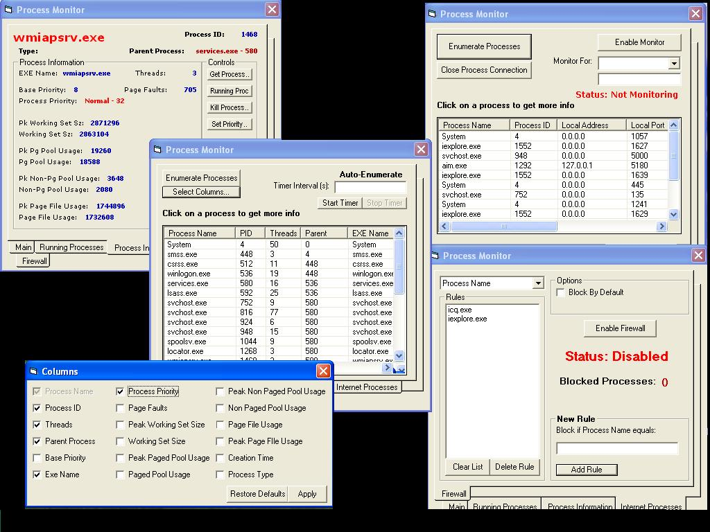



## \[Firewall & Process Monitor\]

### Description

This code enumerates all running process and determines which processes are services, system, and user-run processes. You can pull just about any infomation you want from a process. The program cna also enumerate processes on ports (Using the internet) and can monitor for any you specify and close the connection.

There is also a firewall Which is XP only. It does NOT use the built in windows firewall. It can block programs base on Process Name/Remote IP/Remote Port/Local Port. It can also block program by default and only allowed ones you specify on the previous conditions.
 
### More Info
 

             |
---                |---
**Submitted On**   |2004-12-07 17:28:20
**By**             |[Eric Wolcott](https://github.com/Planet-Source-Code/PSCIndex/blob/master/ByAuthor/eric-wolcott.md)
**Level**          |Intermediate
**User Rating**    |4.7 (75 globes from 16 users)
**Compatibility**  |VB 5\.0, VB 6\.0
**Category**       |[Internet/ HTML](https://github.com/Planet-Source-Code/PSCIndex/blob/master/ByCategory/internet-html__1-34.md)
**World**          |[Visual Basic](https://github.com/Planet-Source-Code/PSCIndex/blob/master/ByWorld/visual-basic.md)
**Archive File**   |[\_Firewall\_1826711272004\.zip](https://github.com/Planet-Source-Code/eric-wolcott-firewall-process-monitor__1-57602/archive/master.zip)

